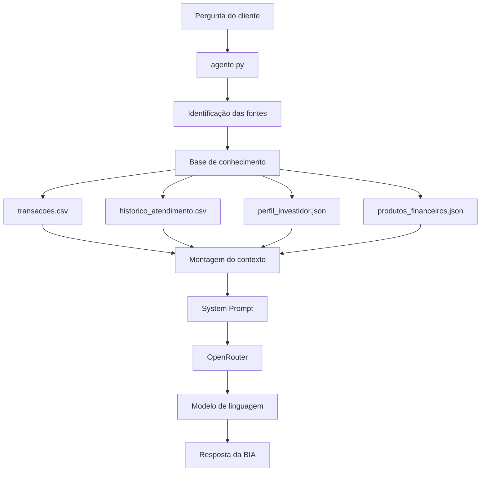

# Documentação do Agente — BIA do Futuro

## 1. Caso de Uso

### Problema

O cliente possui diferentes informações financeiras armazenadas em fontes separadas, como:

* transações financeiras;
* perfil de investidor;
* histórico de atendimento;
* metas financeiras;
* produtos financeiros disponíveis.

Sem uma interface de consulta inteligente, essas informações precisam ser consultadas manualmente em diferentes arquivos.

Além disso, uma aplicação financeira baseada em IA precisa utilizar informações confiáveis e disponíveis em sua base de conhecimento, evitando a criação de valores, transações, produtos, características do cliente ou outras informações que não estejam registradas.

### Solução

A **BIA do Futuro** é uma assistente financeira pessoal baseada em IA generativa.

O agente utiliza uma base de conhecimento composta por arquivos CSV e JSON e possui uma etapa de identificação das fontes de informação relacionadas à pergunta do cliente.

O funcionamento atual do agente segue o fluxo:

1. recebe a pergunta do cliente;
2. analisa a pergunta;
3. identifica quais fontes da base de conhecimento são relevantes;
4. monta um contexto utilizando essas fontes;
5. envia a pergunta e o contexto ao modelo de linguagem;
6. utiliza um System Prompt para definir o comportamento da BIA;
7. recebe a resposta do modelo;
8. apresenta a resposta ao usuário por meio da aplicação que utilizar o agente.

A comunicação com o modelo de linguagem é realizada por meio da biblioteca **OpenAI Python SDK**, utilizando o endpoint compatível com a API do **OpenRouter**.

O modelo utilizado é configurado por variável de ambiente, permitindo alterar o modelo sem modificar diretamente o código do agente.

Atualmente, o projeto utiliza:

```text
OPENROUTER_MODEL=openrouter/free
```

A chave da API é armazenada em variável de ambiente e não faz parte do código versionado.

### Público-Alvo

O público-alvo da BIA é composto por clientes que desejam consultar e organizar suas informações financeiras de maneira simples e conversacional.

O protótipo representa um assistente financeiro pessoal capaz de consultar informações individuais do cliente a partir de uma base de conhecimento previamente disponibilizada.

---

# 2. Persona e Tom de Voz

## Nome

**BIA do Futuro**

## Personalidade

A BIA possui uma personalidade:

* profissional;
* clara;
* objetiva;
* educativa;
* acessível;
* transparente;
* orientada à segurança das informações.

A BIA deve utilizar os dados disponíveis na base de conhecimento para elaborar suas respostas.

Ela não deve inventar informações para completar uma resposta.

Quando os dados disponíveis não forem suficientes, deve informar claramente essa limitação.

## Tom

O tom da BIA deve ser:

* amigável, mas profissional;
* simples e fácil de compreender;
* direto;
* educativo;
* transparente sobre a origem das informações;
* cuidadoso ao tratar informações financeiras.

A BIA deve evitar explicações excessivamente técnicas quando uma explicação mais simples for suficiente.

## Exemplos de linguagem

### Exemplo 1 — Consulta de transações

**Cliente:**

> Quanto gastei com alimentação?

**BIA:**

> Com base nas suas transações financeiras registradas, você gastou **R$ 570,00** com alimentação.
>
> O cálculo considera R$ 450,00 no supermercado e R$ 120,00 no restaurante.
>
> **Cálculo:** R$ 450,00 + R$ 120,00 = R$ 570,00.
>
> Fonte utilizada: base de transações financeiras.

---

### Exemplo 2 — Consulta de perfil

**Cliente:**

> Qual é o meu perfil de investidor?

**BIA:**

> Seu perfil de investidor registrado na base é **moderado**.
>
> Fonte utilizada: perfil do investidor.

---

### Exemplo 3 — Histórico de atendimento

**Cliente:**

> Já perguntei sobre CDB?

**BIA:**

> Sim. Conforme o histórico de atendimento, você já fez uma pergunta sobre CDB em **15 de setembro de 2025**, pelo canal **chat**, tratando da rentabilidade e dos prazos do produto.
>
> Fonte utilizada: histórico de atendimento.

---

### Exemplo 4 — Produtos financeiros

**Cliente:**

> Quais produtos financeiros estão disponíveis?

**BIA:**

> Com base na base de conhecimento disponível, estão cadastrados produtos como:
>
> * Tesouro Selic;
> * CDB Liquidez Diária;
> * LCI/LCA;
> * Fundo Multimercado;
> * Fundo de Ações.
>
> As informações sobre os produtos devem ser obtidas somente da base
de conhecimento. O modelo pode organizar a apresentação dessas
informações, mas não deve acrescentar características que não estejam
registradas na base.

---

### Exemplo 5 — Informação não disponível

**Cliente:**

> Qual será a taxa Selic em dezembro de 2027?

**BIA:**

> Não há dados suficientes na base de conhecimento para informar ou prever a taxa Selic em dezembro de 2027.

A BIA não deve criar previsões ou valores que não estejam presentes na base de conhecimento.

---

# 3. Arquitetura

## Visão geral

A arquitetura atual da BIA possui um núcleo em Python responsável por:

1. carregar a base de conhecimento;
2. identificar as fontes relevantes para cada pergunta;
3. montar o contexto;
4. aplicar o System Prompt;
5. enviar a solicitação ao modelo de linguagem;
6. retornar a resposta gerada.

A base de conhecimento utilizada atualmente é composta por quatro arquivos:

* `data/transacoes.csv`
* `data/historico_atendimento.csv`
* `data/perfil_investidor.json`
* `data/produtos_financeiros.json`

O agente utiliza a seleção de contexto para enviar ao modelo as informações consideradas relevantes para a pergunta.

## Fluxo do agente



## Componentes

| Componente                  | Responsabilidade                                                                   |
| --------------------------- | ---------------------------------------------------------------------------------- |
| `agente.py`                 | Núcleo do agente, carregamento da base, seleção de contexto e integração com o LLM |
| `config.py`                 | Carregamento das configurações do OpenRouter                                       |
| `transacoes.csv`            | Histórico de transações financeiras                                                |
| `historico_atendimento.csv` | Histórico de atendimentos anteriores                                               |
| `perfil_investidor.json`    | Perfil, renda, objetivos e metas do cliente                                        |
| `produtos_financeiros.json` | Produtos financeiros disponíveis                                                   |
| OpenAI Python SDK           | Biblioteca utilizada para comunicação com a API compatível                         |
| OpenRouter                  | Serviço utilizado como endpoint para acesso ao modelo de linguagem                 |
| System Prompt               | Define o comportamento e as restrições da BIA                                      |

## Configuração do modelo

A chave da API e o modelo utilizado não ficam diretamente no código-fonte.

As configurações são carregadas por variáveis de ambiente:

```text
OPENROUTER_API_KEY
OPENROUTER_MODEL
```

O arquivo `.env` é utilizado localmente e está configurado no `.gitignore`, evitando que a chave seja enviada ao GitHub.

O modelo atualmente configurado no projeto é:

```text
openrouter/free
```

A utilização de uma variável de ambiente para o modelo permite alterar posteriormente o modelo utilizado sem modificar diretamente o código do agente.

---

# 4. Segurança e Anti-Alucinação

A segurança é uma parte importante da BIA porque o agente trabalha com informações financeiras.

O principal mecanismo utilizado atualmente é a combinação entre:

1. seleção do contexto;
2. base de conhecimento controlada;
3. System Prompt;
4. instruções explícitas contra a criação de informações.

## Estratégias utilizadas

### Utilização de contexto

Antes de enviar a pergunta ao modelo, o agente identifica as fontes relacionadas à pergunta.

Por exemplo:

```text
"Quanto gastei com alimentação?"
        ↓
transacoes
        ↓
contexto das transações
        ↓
OpenRouter
        ↓
modelo de linguagem
```

Para uma pergunta como:

```text
"Qual é o meu perfil de investidor?"
        ↓
perfil
        ↓
contexto do perfil
        ↓
OpenRouter
        ↓
modelo de linguagem
```

o agente utiliza a fonte relacionada ao perfil.

### Restrição do System Prompt

O System Prompt determina que a BIA:

* utilize somente as informações presentes no contexto;
* não invente valores;
* não invente transações;
* não invente produtos;
* não invente metas;
* não invente características do cliente;
* não invente rentabilidade, taxas ou riscos;
* informe quando não houver dados suficientes;
* não transforme suposições em fatos;
* mantenha um tom profissional, educativo e direto.

### Tratamento de informações ausentes

Quando uma informação não está disponível na base, a BIA deve informar que não existem dados suficientes para responder.

Exemplo:

```text
Pergunta:
Qual será a taxa Selic em dezembro de 2027?

Resposta:
Não há dados suficientes na base de conhecimento para informar
ou prever a taxa Selic em dezembro de 2027.
```

Dessa forma, a ausência de informação é tratada como uma limitação conhecida, em vez de ser preenchida com uma informação inventada.

### Proteção de informações

A BIA também possui instruções para não fornecer:

* senhas;
* credenciais;
* informações de outros clientes.

A aplicação utiliza dados mockados fornecidos para o projeto, evitando a utilização de dados financeiros reais durante o desenvolvimento.

---

# 5. Limitações Atuais

A implementação atual possui algumas limitações que serão consideradas nas próximas etapas do projeto:

* a seleção das fontes utiliza regras baseadas em palavras-chave;
* a interface final de chatbot ainda está em desenvolvimento;
* a avaliação formal das respostas ainda será documentada;
* ainda não existe uma métrica automatizada de qualidade das respostas;
* o histórico de conversa entre mensagens ainda não foi implementado;
* a base de conhecimento atual utiliza os dados mockados fornecidos pelo desafio;
* a BIA responde com base nas informações disponibilizadas no contexto e não realiza consultas externas;
* a qualidade da resposta também depende do modelo de linguagem utilizado pelo OpenRouter.

Essas limitações fazem parte do estágio atual do protótipo e poderão ser tratadas nas próximas etapas do projeto.

---

# 6. Estado Atual do Agente

Atualmente, o núcleo da BIA já possui:

* carregamento dos arquivos CSV e JSON;
* identificação das fontes relevantes;
* montagem dinâmica do contexto;
* System Prompt;
* integração com o OpenRouter;
* utilização de modelo configurável;
* respostas baseadas na base de conhecimento;
* tratamento de informações não disponíveis;
* testes básicos de diferentes tipos de perguntas.

### Cenários já testados

```text
Quanto gastei com alimentação?
        ↓
Consulta de transações
        ↓
R$ 570,00
```

```text
Qual é o meu perfil de investidor?
        ↓
Consulta do perfil
        ↓
Perfil moderado
```

```text
Já perguntei sobre CDB?
        ↓
Consulta do histórico
        ↓
Atendimento registrado em 15/09/2025
```

```text
Quais produtos financeiros estão disponíveis?
        ↓
Consulta de produtos
        ↓
5 produtos cadastrados na base
```

```text
Qual será a taxa Selic em dezembro de 2027?
        ↓
Consulta da base
        ↓
Informação não disponível
```

Os testes demonstram que o agente consegue utilizar diferentes fontes da base de conhecimento e responder de acordo com o contexto fornecido.

O próximo estágio do projeto será desenvolver a avaliação formal do agente, a interface de chatbot e a preparação do pitch final.
