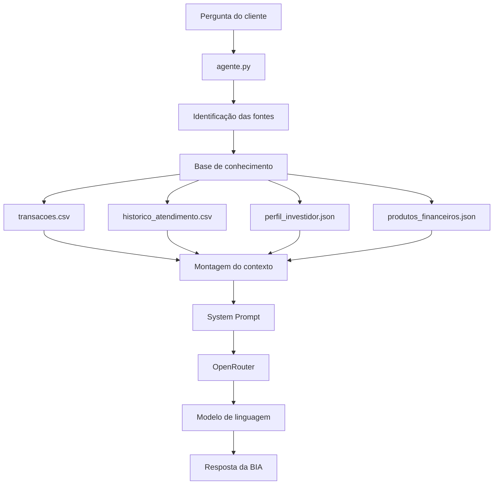

# Documentação do Agente — BIA do Futuro

## 1. Caso de Uso

### Problema

O cliente possui diferentes informações financeiras armazenadas em fontes separadas, como:

- transações financeiras;
- perfil de investidor;
- histórico de atendimento;
- metas financeiras;
- produtos financeiros disponíveis.

Sem uma interface de consulta inteligente, essas informações precisam ser consultadas manualmente em diferentes arquivos.

Além disso, uma aplicação financeira baseada em IA precisa utilizar informações confiáveis e disponíveis em sua base de conhecimento, evitando a criação de valores, transações, produtos, características do cliente ou outras informações que não estejam registradas.

### Solução

A **BIA do Futuro** é uma assistente financeira pessoal baseada em IA generativa.

O agente utiliza uma base de conhecimento composta por arquivos CSV e JSON e possui uma etapa de identificação das fontes de informação relacionadas à pergunta do cliente.

O funcionamento atual do agente segue o fluxo:

1. recebe a pergunta do cliente;
2. analisa a pergunta;
3. identifica quais fontes da base de conhecimento são relevantes;
4. monta um contexto utilizando essas fontes;
5. envia a pergunta e o contexto ao modelo de linguagem;
6. utiliza um System Prompt para definir o comportamento da BIA;
7. recebe a resposta do modelo;
8. retorna a resposta para a aplicação.

A comunicação com o modelo de linguagem é realizada por meio da biblioteca **OpenAI Python SDK**, utilizando o endpoint compatível com a API do **OpenRouter**.

O modelo utilizado é configurado por variável de ambiente, permitindo alterar o modelo sem modificar diretamente o código do agente.

Atualmente, o projeto utiliza:

## OPENROUTER_MODEL=openrouter/free

# 3. Arquitetura

# Visão geral

A arquitetura atual da BIA possui um núcleo em Python responsável por:

1. carregar a base de conhecimento;
2. identificar as fontes relevantes para cada pergunta;
3. montar o contexto;
4. aplicar o System Prompt;
5. enviar a solicitação ao modelo de linguagem;
6. retornar a resposta gerada.

A base de conhecimento utilizada atualmente é composta por quatro arquivos:

* `data/transacoes.csv`
* `data/historico_atendimento.csv`
* `data/perfil_investidor.json`
* `data/produtos_financeiros.json`

O agente utiliza a seleção de contexto para enviar ao modelo as informações consideradas relevantes para a pergunta.

## Fluxo do agente

```mermaid
flowchart TD

    A[Pergunta do cliente] --> B[agente.py]

    B --> C[Identificação das fontes]

    C --> D[Base de conhecimento]

    D --> D1[transacoes.csv]
    D --> D2[historico_atendimento.csv]
    D --> D3[perfil_investidor.json]
    D --> D4[produtos_financeiros.json]

    D1 --> E[Montagem do contexto]
    D2 --> E
    D3 --> E
    D4 --> E

    E --> F[System Prompt]

    F --> G[OpenRouter]

    G --> H[Modelo de linguagem]

    H --> I[Resposta da BIA]
```
