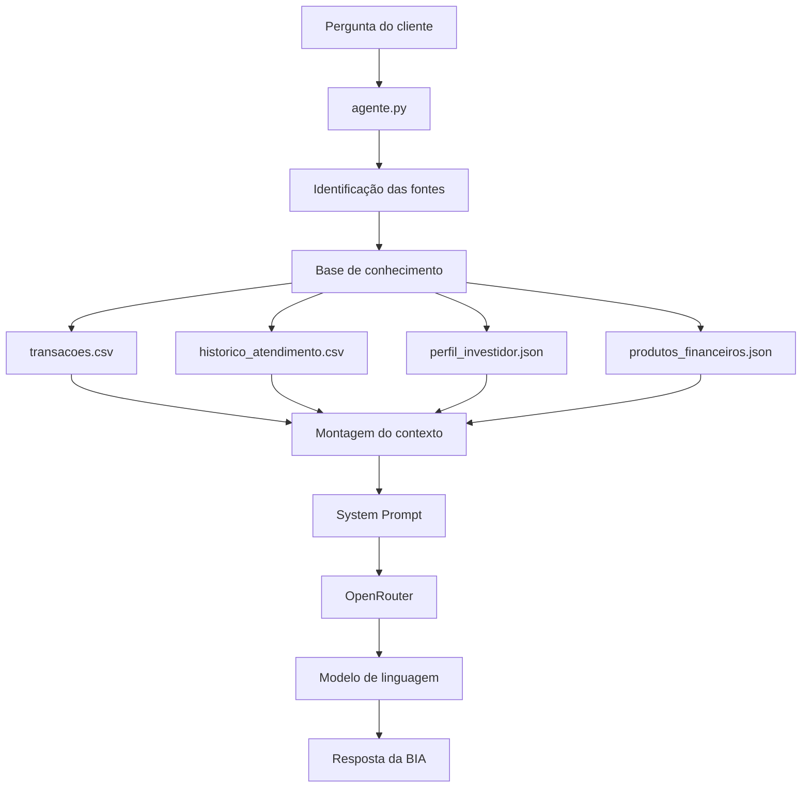

# 🎯 Pitch — BIA do Futuro

## 1. Apresentação

A **BIA do Futuro** é um assistente de finanças pessoais baseado em Inteligência Artificial Generativa.

O projeto demonstra como uma IA pode responder perguntas financeiras utilizando uma **base de conhecimento estruturada**, selecionando as informações relevantes antes de gerar a resposta.

### Objetivo

Criar um assistente capaz de:

* Consultar informações financeiras;
* Utilizar contexto antes de responder;
* Responder de forma clara e objetiva;
* Evitar informações inventadas;
* Informar quando determinado dado não está disponível.


---

## 2. Problema

Informações financeiras podem estar distribuídas em diferentes fontes, como:

* Transações;
* Histórico de atendimento;
* Perfil do investidor;
* Metas financeiras;
* Produtos financeiros.

Consultar essas informações manualmente pode dificultar a análise e tornar a busca mais demorada.

Além disso, uma IA precisa receber **contexto adequado** para evitar respostas baseadas em informações que não estão disponíveis na base.


Exemplo:

```text
data/
├── transacoes.csv
├── historico_atendimento.csv
├── perfil_investidor.json
└── produtos_financeiros.json
```

---

## 3. Solução

A BIA utiliza um fluxo de processamento para identificar quais informações são necessárias antes de consultar o modelo de IA.

### Fluxo

```text
Pergunta do usuário
        ↓
Identificação das fontes relevantes
        ↓
Seleção dos dados
        ↓
Montagem do contexto
        ↓
System Prompt
        ↓
OpenRouter
        ↓
Modelo de IA
        ↓
Resposta da BIA
```

A aplicação utiliza as funções:

* `identificar_fontes(pergunta)`
* `montar_contexto(pergunta)`

Dessa forma, o modelo recebe a pergunta acompanhada apenas do contexto necessário para gerar a resposta.





---

## 4. Base de Conhecimento

A base de conhecimento foi organizada em arquivos locais CSV e JSON.

| Arquivo                     | Informações                                 |
| --------------------------- | ------------------------------------------- |
| `transacoes.csv`            | Gastos, categorias, valores e datas         |
| `historico_atendimento.csv` | Histórico de atendimentos                   |
| `perfil_investidor.json`    | Perfil, objetivos e informações financeiras |
| `produtos_financeiros.json` | Produtos e características disponíveis      |

Essa estrutura permite separar os diferentes tipos de informação utilizados pela BIA.


---

## 5. Tecnologias utilizadas

O projeto foi desenvolvido utilizando:

* **Python**
* **OpenAI Python SDK**
* **OpenRouter**
* **Modelos de linguagem**
* **CSV**
* **JSON**
* **Git**
* **GitHub**

O modelo utilizado pode ser configurado por variável de ambiente:

```env
OPENROUTER_MODEL=openrouter/free
```

A utilização do OpenRouter permite integrar o projeto a modelos compatíveis com a API utilizada pela aplicação.


---

## 6. Segurança e confiabilidade

Um dos principais objetivos do projeto é evitar que a IA invente informações.

A BIA segue regras definidas no **System Prompt**, como:

* Utilizar somente informações presentes no contexto;
* Não inventar valores;
* Não inventar transações;
* Não inventar produtos;
* Não inventar características do cliente;
* Não inventar taxas ou rentabilidades;
* Informar quando uma informação não estiver disponível;
* Não fornecer dados de outros clientes;
* Não solicitar ou fornecer credenciais;
* Não apresentar suposições como fatos.

Quando uma informação não existe na base, a BIA deve informar que não possui dados suficientes para responder.


```text
Qual será a taxa Selic em dezembro de 2027?
```

> A resposta deve demonstrar que a BIA **não inventa uma previsão** quando esse dado não está disponível na base.

---

## 7. Demonstração prática

### Exemplo: análise de despesas

Pergunta:

```text
Quanto gastei com alimentação?
```

A BIA identifica que a fonte necessária é:

```text
transacoes.csv
```

Na base de demonstração existem:

* Supermercado: R$ 450,00
* Restaurante: R$ 120,00

Total:

```text
R$ 450,00 + R$ 120,00 = R$ 570,00
```

A BIA apresenta o resultado utilizando os dados encontrados na base.


> Mostre a pergunta:

```text
Quanto gastei com alimentação?
```

> e a resposta da BIA mostrando:

```text
R$ 570,00
```

Esse print demonstra na prática:

**Pergunta → seleção do contexto → cálculo → resposta**

---

## 8. Outros exemplos de interação

### Perfil do investidor

Pergunta:

```text
Qual é o meu perfil de investidor?
```

A BIA consulta:

```text
perfil_investidor.json
```

E utiliza somente as informações presentes nesse arquivo.


---

### Histórico de atendimento

Pergunta:

```text
Já perguntei sobre CDB?
```

A BIA consulta:

```text
historico_atendimento.csv
```

E apresenta as informações encontradas no histórico.


---

## 9. Diferencial do projeto

O diferencial da BIA não está apenas na utilização de um modelo de Inteligência Artificial.

O projeto combina:

```text
Base de Conhecimento
        +
Seleção de Contexto
        +
System Prompt
        +
Modelo de IA
        =
BIA do Futuro
```

Essa estrutura permite controlar melhor quais informações são fornecidas ao modelo antes da geração da resposta.


---

## 10. Próximos passos

O projeto pode ser evoluído com:

* Melhorias na identificação automática das fontes;
* Expansão da base de conhecimento;
* Inclusão de novos tipos de dados financeiros;
* Interface gráfica;
* Avaliação automática das respostas;
* Testes com perguntas mais complexas;
* Integração controlada com novas fontes de informação;
* Melhorias no sistema de segurança e validação.


## 11. Conclusão

A **BIA do Futuro** demonstra uma aplicação prática de Inteligência Artificial Generativa utilizando uma base de conhecimento estruturada.

O projeto combina:

> **IA + Contexto + Segurança + Transparência**

A arquitetura permite que a IA utilize informações específicas da base de conhecimento e reconheça quando não possui dados suficientes para responder.


